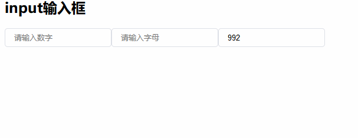

# x-input
react.js文本输入框，限制输入内容为数字、字母、千分位等
***
## npm安装

```bash
npm install jsx-input --save
```
基本使用方式
```js
import { Input,NumericInput,InterInput,PosInterInput,LetterInput,ThousandInput } from 'jsx-input';
        <InterInput placeholder="请输入数字"/>
        <LetterInput placeholder="请输入字母"/>
        <ThousandInput placeholder="千分位数字"/>
```
效果图如下


## Input 
输入框
## NumericInput
纯数字输入框，只能输入正负整数或小数，属性`decimals`限制小数位数
## LetterInput
纯字母输入框
## ThousandInput
带千分位的数字输入框，属性`decimals`限制小数位数
## PosInterInput
正整数输入限制
## InputContainer (Input,regular)
高阶组件，可以对input进行格式定制，第二个参数为格式化的正则表达式，如上面的数字输入框 `InputContainer(Input,/^-?(0|[1-9][0-9]*)$/);`
### 关于作者
[https://github.com/tianxiangbing](https://github.com/tianxiangbing)

### xui
react xui组件一直在持续更新中，欢迎大家关注[https://github.com/react-xui](https://github.com/react-xui)